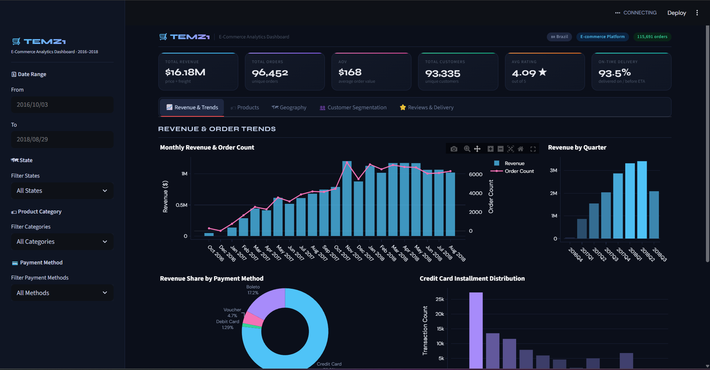

# TEMZ1 E-Commerce Analytics Dashboard

Modern, interactive dashboard for analyzing E-Commerce public dataset 2016–2018 built with **Streamlit** and **Plotly**.

  

## Cara Menjalankan Dashboard Secara Lokal

Ikuti langkah ini setelah extract ZIP submission. Pastikan kamu berada di folder utama (yang ada `dashboard/`, `notebook.ipynb`, dll).

### 1. Setup Environment - Anaconda (Paling Direkomendasikan)

```bash
conda create --name ecom-dash python=3.13
conda activate ecom-dash
pip install -r requirements.txt
```

### 2. Setup Environment - Shell/Terminal
```bash
# Masuk ke folder submission yang sudah di-extract
cd path/ke/folder/submission

# Install library
pip install -r requirements.txt
```

### Jalankan Dashboard
streamlit run dashboard/dashboard.py

## Live Demo
Dashboard sudah di-deploy di Streamlit Community Cloud:
[ecommerce-data-analytics](https://temz1-ecommerce-data-analytics.streamlit.app/)

🎯 Purpose
Proyek ini dibuat untuk submission kelas/kursus Dicoding Belajar Analisis Data. Menunjukkan kemampuan:

Data cleaning & feature engineering
Exploratory Data Analysis (EDA)
Interactive visualization
Customer segmentation (RFM)
Dashboard deployment

📄 License
MIT License – feel free to use, modify, and learn from it.
🙌 Acknowledgments

Dataset: Dicoding
Inspiration: Streamlit gallery, Plotly docs
Built with love in Tangerang 🇮🇩

Made with ❤️ by TM