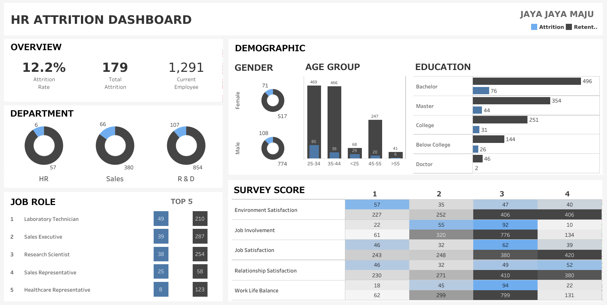

# Proyek Pertama: Menyelesaikan Permasalahan Sumber Daya Manusia - Jaya Jaya Maju

## Business Understanding

Jaya Jaya Maju merupakan perusahaan multinasional yang berdiri sejak tahun 2008. Dengan ribuan karyawan yang tersebar di berbagai departemen, perusahaan menyadari bahwa aset paling berharga mereka adalah sumber daya manusia. Namun, perusahaan menghadapi tantangan besar berupa tingginya tingkat perputaran karyawan (attrition rate). Kehilangan talenta berbakat secara mendadak tidak hanya mengganggu operasional harian, tetapi juga meningkatkan biaya rekrutmen dan pelatihan ulang yang signifikan.

### Permasalahan Bisnis

- Identifikasi Driver Attrition: Faktor-faktor apa saja yang secara signifikan mendorong karyawan untuk meninggalkan perusahaan?

- Ketidakseimbangan Data: Bagaimana cara membangun model prediksi yang akurat meskipun jumlah karyawan yang resign jauh lebih sedikit dibandingkan yang bertahan?

- Prediksi Proaktif: Bagaimana perusahaan dapat mendeteksi karyawan yang berisiko tinggi untuk keluar (Flight Risk) guna melakukan tindakan preventif?

### Cakupan Proyek

- Exploratory Data Analysis (EDA): Melakukan visualisasi mendalam untuk menemukan pola tersembunyi pada data karyawan.

- Data Preprocessing: Melakukan encoding variabel kategorikal dan penanganan class imbalance menggunakan metode SMOTETomek.

- Machine Learning Modeling: Membangun dan membandingkan performa model Random Forest, Gradient Boosting, dan XGBoost.

- Model Interpretation: Menggunakan SHAP untuk memahami kontribusi setiap fitur terhadap prediksi model.

- Optimization: Melakukan tuning decision threshold untuk memaksimalkan metrik Recall pada - kelas minoritas.

### Persiapan

Sumber data: [employee_data.csv](https://github.com/dicodingacademy/dicoding_dataset/tree/main/employee)

Setup environment:
Proyek ini dikembangkan menggunakan Python versi 3.9+. Untuk mereplikasi proyek ini, disarankan menggunakan virtual environment agar library tetap terisolasi.

### 1. Membuat & Mengaktifkan Virtual Environment:
```
# Masuk ke direktori proyek
cd nama-folder-proyek

# Membuat venv
python -m venv venv

# Mengaktifkan venv (Windows)
.\venv\Scripts\activate

# Mengaktifkan venv (Mac/Linux)
source venv/bin/activate
```

### 2. Instalasi Library (Dependency):
Pastikan Anda sudah berada di dalam virtual environment, lalu jalankan:
```
pip install -r requirements.txt
```

### 3. Cara Menjalankan Prediksi (Script .py):
Untuk melakukan prediksi pada data baru menggunakan model yang sudah dilatih:
```
python predict.py
```
## Business Dashboard

Business Dashboard ini dirancang menggunakan Tableau untuk memberikan High-Level Overview kepada tim HR. Dashboard ini mencakup tren distribusi attrition berdasarkan Department, Pekerjaan Karyawan dan tingkat kepuasan kerja.

## Link Dashboard: [employee-retention-system](https://public.tableau.com/app/profile/mif.tama/viz/SUBMISSION/HRATTRITIONDASHBOARD?publish=yes)

## Conclusion

Berdasarkan hasil analisis dan pemodelan, dapat disimpulkan bahwa:

### 1. Karakteristik Attrition (Hasil Analisis Data)
- Kompensasi & Insentif: Karyawan dengan tingkat MonthlyIncome yang rendah dan StockOptionLevel 0 memiliki kecenderungan resign yang jauh lebih tinggi.

- Kepuasan Kerja: Terdapat korelasi negatif antara JobSatisfaction dengan attrition; karyawan yang merasa tidak puas (skor 1-2) mendominasi jumlah pengunduran diri.

- Faktor Lingkungan: Karyawan yang sering melakukan Overtime dan memiliki jarak rumah yang jauh menunjukkan risiko attrition yang lebih besar.

### 2. Performa Model Machine Learning
- Metrik Kuantitatif: Model Random Forest terpilih sebagai model terbaik dengan performa sebagai berikut:

    - ROC-AUC Score: 0.771 (Menunjukkan kemampuan pembedaan kelas yang baik).

    - Recall (Minority Class): Dioptimalkan hingga mencapai ~60% melalui penggunaan threshold 0.339 (Penting untuk meminimalkan False Negative atau karyawan berisiko yang tidak terdeteksi).

    - F1-Score: 0.51.

- Fitur Paling Berpengaruh: Berdasarkan hasil Feature Importance dan SHAP values, fitur yang paling mempengaruhi model secara berurutan adalah StockOptionLevel, MonthlyIncome, TotalWorkingYears, serta satisfaction karyawan.

### Rekomendasi Action Items

Berikan beberapa rekomendasi action items yang harus dilakukan perusahaan guna menyelesaikan permasalahan atau mencapai target mereka.

- Optimasi Kebijakan Lembur: Melakukan audit beban kerja pada departemen dengan tingkat lembur tinggi dan memberikan kompensasi atau waktu istirahat tambahan.

- Review Insentif Saham: Mempertimbangkan pemberian Stock Option yang lebih kompetitif bagi karyawan di level menengah untuk meningkatkan loyalitas jangka panjang.

-  Kesejahteraan & Kompensasi: Melakukan penyesuaian gaji (Salary Adjustment) secara berkala, khususnya bagi peran-peran kritis yang memiliki pendapatan di bawah median pasar.

- Intervensi Dini melalui Stay Interview: Memprioritaskan wawancara mendalam kepada karyawan yang teridentifikasi "At Risk" oleh sistem prediksi untuk mendengar keluhan dan aspirasi mereka.
