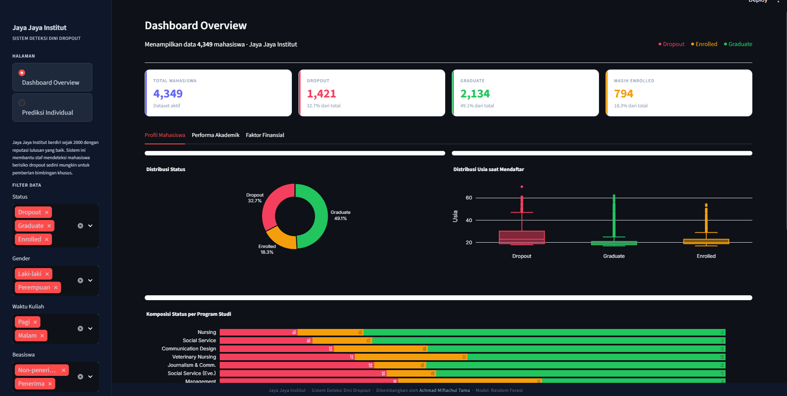

# Proyek Akhir: Menyelesaikan Permasalahan Perusahaan Edutech

## Business Understanding
Jaya Jaya Institut merupakan salah satu institusi pendidikan perguruan yang telah berdiri sejak tahun 2000. Hingga saat ini ia telah mencetak banyak lulusan dengan reputasi yang sangat baik. Akan tetapi, terdapat banyak juga siswa yang tidak menyelesaikan pendidikannya alias dropout.

Jumlah dropout yang tinggi ini tentunya menjadi salah satu masalah yang besar untuk sebuah institusi pendidikan. Oleh karena itu, Jaya Jaya Institut ingin mendeteksi secepat mungkin siswa yang mungkin akan melakukan dropout sehingga dapat diberi bimbingan khusus.

### Permasalahan Bisnis
Jumlah dropout yang tinggi berdampak negatif pada reputasi dan operasional institusi. Jaya Jaya Institut membutuhkan sistem Early Warning yang dapat mendeteksi mahasiswa berisiko tinggi sedini mungkin agar dapat diberikan intervensi atau bimbingan khusus.

### Cakupan Proyek
- EDA: Mengeksplorasi dataset untuk menemukan pola tersembunyi penyebab dropout.
- Data Cleaning: Menangani data serta membersihkan anomali (seperti mahasiswa lulus tanpa SKS terdaftar).
- Modeling: Membangun model 3 Machine Learning (Logistic Reggression, Random Forrest, XGBoost) untuk klasifikasi status mahasiswa.
- Melakukan evaluasi dan memilih Random Forrest dari model machine learning tersebut
- Deployment: Membuat Dashboard interaktif 2-halaman menggunakan Streamlit.
- Actionable Insights: Memberikan rekomendasi strategis berdasarkan feature importance.
### Persiapan

Sumber data: Dicoding ( [data.csv](https://github.com/dicodingacademy/dicoding_dataset/blob/main/students_performance/data.csv) )

#### Setup environment:
```bash
# Masuk ke folder submission yang sudah di-extract
cd path/ke/folder/ecommerce-data-analytics

# Install library
pip install -r requirements.txt
```

## Business Dashboard


Dashboard dibangun dengan prinsip User-Centered Design, membagi informasi ke dalam dua fokus utama:

#### Halaman 1: Analytics Overview
Menampilkan metrik utama dan visualisasi tren data:

- KPI Cards: Total Mahasiswa, Dropout Rate, Rata-rata IPK, dan Persentase Beasiswa.

- Demografi: Distribusi status berdasarkan Usia, Gender, dan Waktu Kuliah (Pagi/Malam).

- Akademik: Korelasi antara nilai Semester 1 & 2 terhadap peluang kelulusan.

- Finansial: Analisis pengaruh status pembayaran SPP (Tuition Fees) dan Debtor terhadap risiko dropout.

#### Halaman 2: Student Risk Predictor
Halaman fungsional bagi staf akademik untuk memasukkan data mahasiswa secara individu dan mendapatkan hasil prediksi real-time (Dropout/Enrolled/Graduate) menggunakan model Random Forest.

## Menjalankan Sistem Machine Learning
Mau tahu risiko dropout mahasiswa secara spesifik? Langsung aja meluncur ke halaman Prediksi Individual di sidebar. Di sana, lo tinggal mainin inputnya:

1. Input Data: Masukkan detail mahasiswa mulai dari Identitas (Program Studi, Umur), Financial (Status Beasiswa & SPP), sampai Performa Akademik (IPK Semester 1 & 2).

2. Real-time Prediction: Sistem bakal langsung memproses data tersebut menggunakan model Random Forest untuk menentukan apakah mahasiswa tersebut berstatus Dropout, Enrolled, atau Graduate.

3. Get Insights: Nggak cuma hasil prediksi, sistem juga bakal ngasih Saran Tindakan yang perlu diambil staf akademik buat ngebantu mahasiswa tersebut.

#### Jalankan Business Dashboard dan Prediction:
```bash
streamlit run app.py
```

atau bisa diakses melalui [student-dropout-prediction](https://temz1-student-dropout.streamlit.app/)


## Conclusion
1. Kualitas & Integritas Data
- Dataset telah dibersihkan dari 300+ data anomali di mana mahasiswa berstatus Graduate namun memiliki histori akademik kosong (0 SKS) dan Dataset tidak memiliki null ataupun duplikasi data.

- Data sudah di encode kecuali Status, namun telah diproses menggunakan Label Encoding dan dilatih model berbasis pohon (Tree-based) tanpa menambah beban dimensionalitas data.

2. Performa Model
- Algoritma Random Forest dipilih karena ketahanannya terhadap data non-linear dan kemampuannya menangani fitur kategori yang luas (seperti program studi).

- Model mencapai akurasi tinggi (91%) dan telah dioptimasi menggunakan threshold khusus (0.48) untuk memastikan mahasiswa yang benar-benar berisiko tidak terlewatkan oleh sistem bimbingan.

3. Faktor Utama Pendorong Dropout
Berdasarkan Feature Importance, tiga faktor utama penyebab mahasiswa berhenti kuliah adalah:

    1. Curricular Units Approved (Semester 2 & 1): Kegagalan meluluskan mata kuliah di tahun pertama adalah indikator terkuat (red flag) risiko dropout.

    2. Tuition Fees Up to Date: Kendala finansial (tunggakan SPP) berkorelasi langsung dengan pengunduran diri mahasiswa.

    3. Age at Enrollment: Mahasiswa dengan usia pendaftaran yang lebih tua memiliki risiko lebih tinggi, kemungkinan dikarenakan konflik prioritas antara pekerjaan/keluarga dan studi.

### Rekomendasi Action Items
1. Intervensi Akademik Dini: Fokuskan bantuan pada mahasiswa yang meluluskan kurang dari 50% SKS di semester 1. Jangan menunggu hingga semester 2 berakhir.

2. Fleksibilitas Finansial: Memberikan opsi cicilan atau beasiswa bantuan bagi mahasiswa yang terdeteksi berisiko dropout namun memiliki rekam jejak akademik yang baik.

3. Sistem Pendampingan Mahasiswa Dewasa: Menyediakan layanan konseling atau jadwal kuliah yang lebih fleksibel bagi mahasiswa dengan usia pendaftaran non-tradisional.

4. Deployment Model ke Sistem Informasi: Mengintegrasikan model ini ke dalam portal akademik dosen wali agar "Skor Risiko" mahasiswa muncul secara otomatis saat pengisian KRS atau input nilai.
